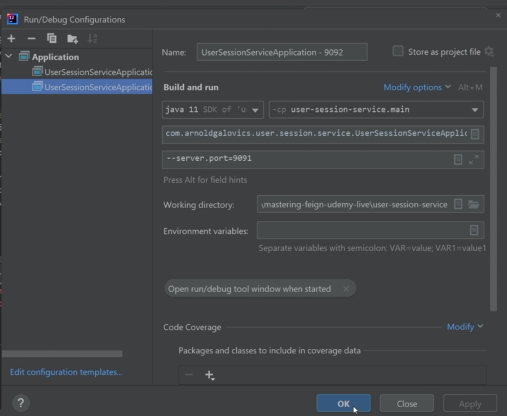

# Mastering microservice communication with Spring Cloud Feign
The repository contains the practice content for the Mastering microservice communication with Spring Cloud Feign training on Udemy.

Here you can access the course: [link](https://www.udemy.com/course/mastering-microservice-communication-with-spring-cloud-feign/?referralCode=437693FE520ABDF6F4E3)

Here you can see the circuitBreaker docs: [link](https://resilience4j.readme.io/docs/circuitbreaker)

localhost Eureka URL: [link](http://localhost:8761/dashboard)

To run the multiple instances we can configure like this


## Overview
The courses focuses on building an example microservice system with resilient HTTP communication using Feign and Spring Cloud OpenFeign along with Netflix Eureka and Resilience4J.

Among a lot of exciting topics, here's an extract of the curriculum: 
* Feign request/response mappings using annotations
* Feign logging
* Base clients
* Request interceptors
* Customizing error handling
* Request timeout options and following redirects
* Async HTTP communication
* Exposing Dropwizard and Micrometer metrics
* Spring Cloud OpenFeign request/response mappings using annotations
* Maintainable error handling with Spring Cloud OpenFeign
* Eureka integration with Feign for service resolution
* Feign client fallbacks
* Error-based circuit breaking with Resilience4J
* Slowness-based circuit breaking with Resilience4J
* Exposing circuit breaker metrics to Actuator
* Cutting off traffic when request are taking too long using Resilience4J
* Client side load balancing to multiple service instances
* Integration testing Feign clients
* Circuit breaking integration testing
* Client side load balancing integration testing

## Structure
There is a separation between the course content. The first one is using regular Feign with the Feign annotations and configurations. The other is using Spring Cloud OpenFeign to provide the same functionality.

The first can be found on the [regular-feign](https://github.com/galovics/mastering-feign-practice/tree/regular-feign) branch and the latter is on the [spring-feign](https://github.com/galovics/mastering-feign-practice/tree/spring-feign) branch.

## Feedback and questions
I always appreciate feedback. If you think the course was useful,
let me know. If you think it needs some polishing, that's also welcome.

Also, don't hesitate to contact me in case you have questions or ideas.

You can reach me at Twitter [@ArnoldGalovics](https://twitter.com/ArnoldGalovics), [Facebook](https://www.facebook.com/arnold.galovics.engineer)
or write a mail to [info@arnoldgalovics.com](mailto:info@arnoldgalovics.com).

# License
```text
Licensed under the Apache License, Version 2.0 (the "License");
you may not use this file except in compliance with the License.
You may obtain a copy of the License at

   http://www.apache.org/licenses/LICENSE-2.0

Unless required by applicable law or agreed to in writing, software
distributed under the License is distributed on an "AS IS" BASIS,
WITHOUT WARRANTIES OR CONDITIONS OF ANY KIND, either express or implied.
See the License for the specific language governing permissions and
limitations under the License.
```